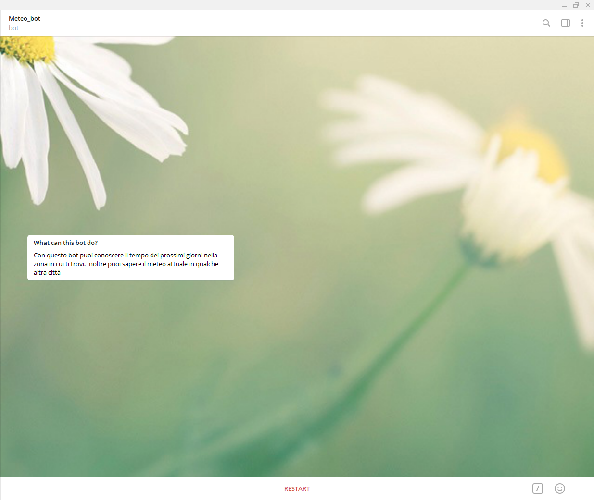
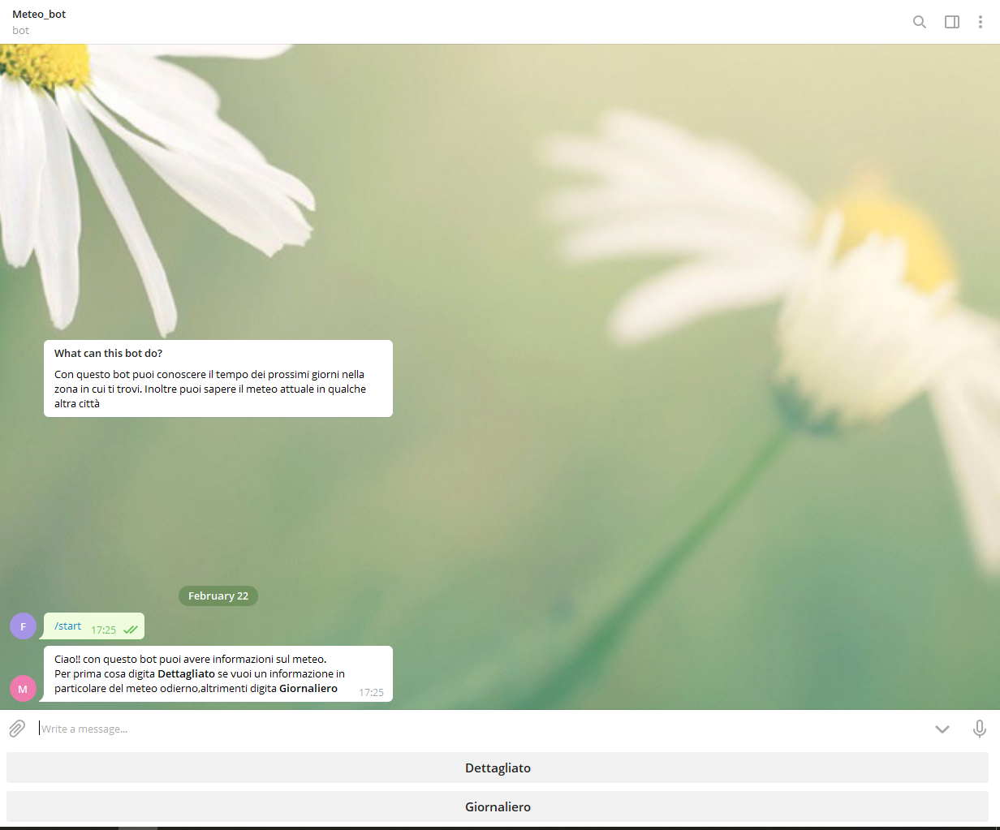
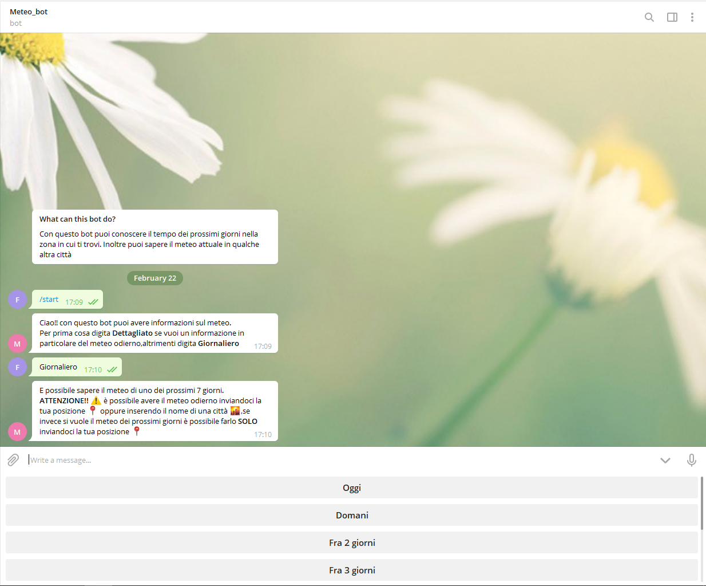
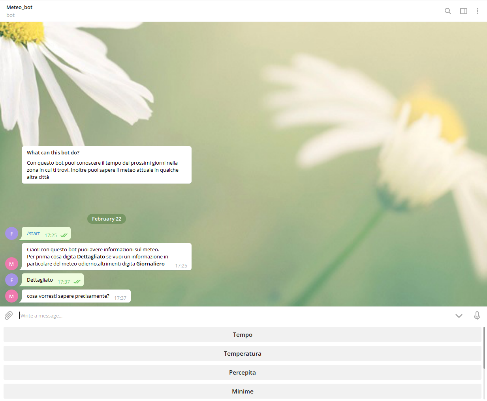
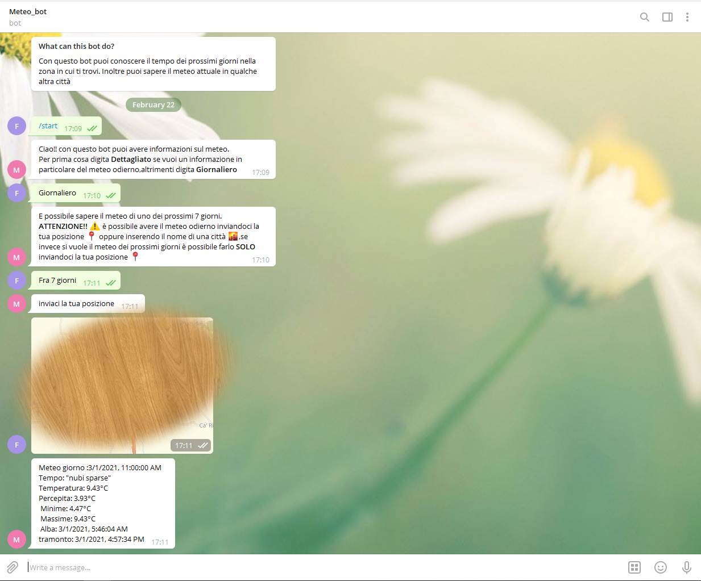
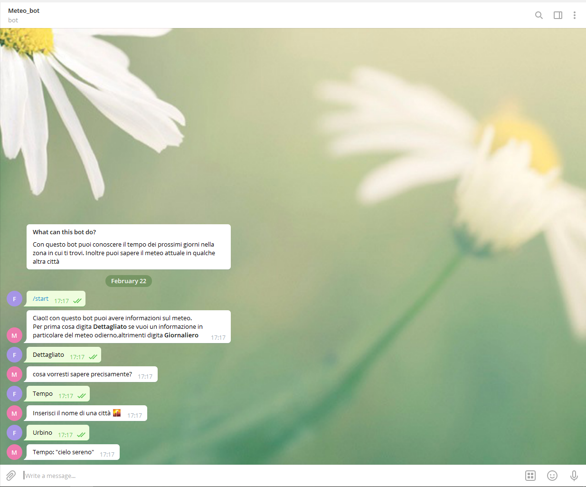

# Meteo_BOT #

## Progetto Piattaforme Digitali per la Gestione del Territorio ##

### Studente: ###
* [Ducci Francesco mat n°283055](https://github.com/Francy9)

-----------------------------------------------------

## Descrizione ##

Lo scopo di questo progetto è dare la possibilità all' utente finale di:
* conoscere il meteo del luogo in cui si trova per i prossimi 7 giorni.
* conoscere il meteo attuale di una città.
* conoscere solo una specifica componente metereologica(tempo,temperatura,massime,minime,alba,tramonto,). 

-----------------------------------------------------

## Relazione ##
Il progetto si basa sulla creazione di un API in NodeJS che effettua richieste ai server di "openWeather" richiedendo file di tipo json, e l' implementazione di un bot telegram in php. 

-----------------------------------------------------

<h1>Descrizione Progetto </h1>
In base a quello che l'utente sceglie il bot telegram effettuerà una richiesta all'API che a sua volta inoltrerà una richiesta ai server di "openWeather" ottenendo come risposta un file json. Di questo file vengono prese solo determinate parti e inviate sottoforma di testo come risposta alla precedente richiesta effettuata dal bot.
Quello che ottiene l'utente finale è un file di testo inviatogli come messaggio telegram contenente parte delle informazioni prese dai server di "openWeather".
nel caso si voglia sapere il meteo attuale l'API effettua richieste a url di questo tipo:
* api.openweathermap.org/data/2.5/weather?q={city name}&appid={API key}&mode=json&units=metric&lang=it

Nel caso invece si voglia richiedere il meteo di un giorno della settimana l'API effettuerà richieste a url di questo tipo:
* https://api.openweathermap.org/data/2.5/onecall?lat={lat}&lon={lon}&exclude=current,minutely,hourly,alerts&appid={API key}&mode=json&units=metric&lang=it

l'url dell'API è :
* https://server-openweather.herokuapp.com/

l'url del bot telegram è :
* https://bot-telegram-meteo.herokuapp.com/

Per la messa online del servizio è stato usato heroku sia per L'API che per il bot telegram.

<h2>Bot di telegram </h2>
Una volta aver avviato l'applicazione telegram e ricercato il bot denominato "Meteo_bot" avremmo una chiat che si presenta così:

Una volta avviato il bot verrà inviato un messaggio di benvenuto e apparià una keyboard con due opzioni. La prima è quella di poter richiedere un meteo dettagliato, la seconda è quella di richiedere il meteo di un determinato giorno:

In caso si scerlga il meteo giornaliero potremmo selezionare il giorno di cui si vuol conoscere il meteo :

In caso si scerlga il meteo dettagliato avremmo una serie di opzioni per poter decidere cosa voglianmo sapere precisamente :

In caso vogliamo sapere il meteo di un giorno che non sia quello odierno dovremmo inviare la nosra posizione :

Se ad esempio si vuole conoscere il tempo in un determinato luogo bisogna procedere come segue:

